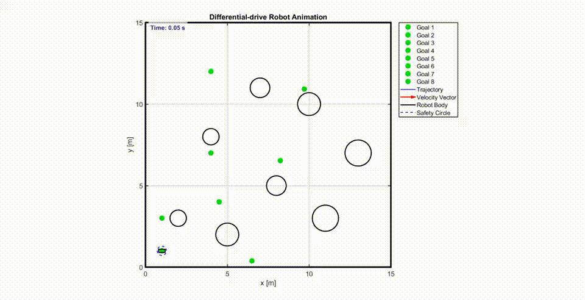

# Optimal Trajectory Tracking with Obstacle Avoidance  
### for Differential Mobile Robots

This repository contains the implementation and experiments for the project **“Optimal Trajectory Tracking with Obstacle Avoidance for Differential Mobile Robots”**, developed as part of the **Numerical Optimization for Control** course.

The work focuses on **Model Predictive Control (MPC)** with advanced constraint handling techniques for **static and dynamic obstacle avoidance**, including **Control Barrier Functions (CBFs)**.

---

## 📌 Project Overview

Autonomous mobile robots operating in real-world environments must track reference trajectories while safely avoiding obstacles. This project addresses this challenge using an MPC-based framework that:

- Handles **trajectory tracking**
- Avoids **static and dynamic obstacles**
- Ensures **constraint satisfaction**
- Improves numerical stability and feasibility

The robot model considered is a **differential-drive mobile robot**.

---

## 🚀 Key Improvements Over Baseline

Compared to previous implementations, this project introduces several important enhancements:

- ✅ Support for **multiple types of static and dynamic obstacles**
- ✅ Removal of **barrier functions from the cost**, leading to a **well-posed constrained optimization problem**
- ✅ **Linearization of static obstacle constraints** for improved computational efficiency
- ✅ **Control Barrier Function (CBF)** formulation for **dynamic obstacle avoidance**
- ✅ Experiments with **Multiple Shooting** MPC formulation
- ✅ Addition of an **artificial LiDAR range sensor** for environment perception

---

## 🧠 Methodology

### Model Predictive Control (MPC)

- Finite-horizon optimization
- Constraints enforced directly in the optimization problem
- Receding horizon strategy
- Differential-drive robot dynamics

---

### Obstacle Modeling

#### Circular Obstacles
- Modeled using distance-based constraints
- Constraints are **linearized** around the predicted trajectory

#### Rectangular Obstacles
- Approximated using **ellipses**
- Elliptical constraints are linearized to maintain convexity

---

### Dynamic Obstacle Avoidance

Dynamic obstacles are handled using **Control Barrier Functions (CBFs)**:

- **Continuous-time CBF formulation**
- **Discrete-time CBF constraints** embedded into MPC
- Guarantees **forward invariance** of safe sets
- Ensures collision avoidance even with moving obstacles

---

## 🌍 Environments

- Static-only environments
- Dynamic obstacle environments
- Mixed environments with both static and dynamic obstacles
- Comparative evaluation against previous environments

---

## 📊 Results & Conclusions

- The proposed MPC + CBF framework successfully avoids both static and dynamic obstacles
- Linearized constraints improve solver performance
- Removing barrier terms from the cost improves numerical robustness
- CBF-based dynamic obstacle handling ensures safety without overly conservative behavior

---

## 🔄 Alternative & Future Methods

Potential extensions and alternative approaches include:

- Treating **CBF parameters as optimization variables**
- Using **feedback linearization** or low-level torque controllers
- **ORCA-based methods** for multi-robot and dense dynamic environments
- **Artificial Potential Fields (APF)** for local planning
- **RRT-based planners** for global path planning in fully explored maps

---

## 📚 References

- Ames et al., *Control Barrier Functions: Theory and Applications*, ECC 2019  
- Jian et al., *Dynamic CBF-based MPC for Safety-Critical Obstacle Avoidance*, ICRA 2023  
- Yoon et al., *Model-Predictive Active Steering and Obstacle Avoidance*, Control Engineering Practice, 2009  
- Xiong et al., *Discrete-Time Control Barrier Functions*, IEEE Transactions on Cybernetics, 2023  
- Ali et al., *Linear MPC with CBFs for Differential Drive Robots*, arXiv 2024

---

## 👥 Authors

- **SB, HG EE**   
---

## 🏫 Course Information

**Numerical Optimization for Control**  
Instructor: **Prof. Lorenzo Mario Fagiano**

---

